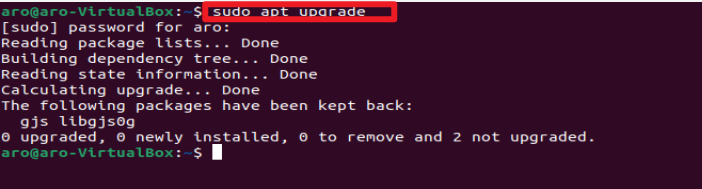
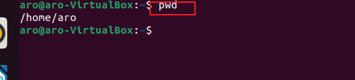
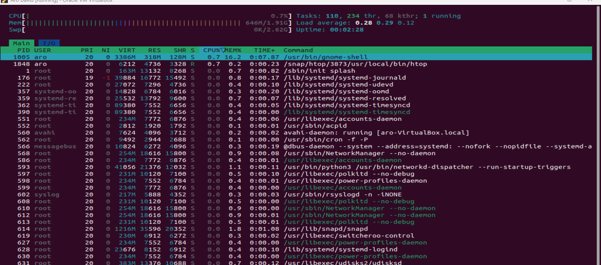

# Linux Implementation
## Introduction to Linux and Basic Commands
A Linux command is a program or utility that runs on the cli . Linux commands are executed by pressing Enter at the end of the line . You can run commands to perform various tasks , from package installation to user management and file manipulation. 
A command line generally looks like :

`CommandName [option(s)]`
`parameter(s)]`

### File Manipulation
#### 1. Sudo Command

The Sudo command is also known as the super user do command which is used to grant administration priviledges to a ceratin user to manipulate root files and folders

The general syntax is `sudo`

for example
`sudo apt upgrade`

##### 2. PWD command 
Pwd command is used to find the path of your curent/working directory. 

the pwd command uses the following syntax :

`pwd[option]`

it has two acceptable options 

-L(logical) prints environment variable content including symbolic links

-P(physical) prints the actual path of the current directory

`pwd`

#### 3 . cd Command
the cd command is used to navigate through the linux files and direcxtories

it used the syntax below :

`cd commandsLinux`

example;

`cd Documents`

below are some shortcuts to help navigate :

`cd ~ [username]`goes to another user's home directory

`cd ..` moves to one directory up

`cd-` moves to your previous directory

#### 4. ls Command
 This command lists files and directories within a system. when you run the command without any arguments , it will display the content of the currrent directory. 

 

 To see other directories content , type ls followedd by the desired path . example , to view files in the Documents folder , simply Enter :

 `ls Documents`

 

 Below are some options you can use with ls command:

 `ls -R` list all the files in the Subdirectories

`ls -a` Shows hidden files in adittion to the visible ones

`ls -lh`  shows the file sizes in easily readable formats such as MB,GB , and TB

#### 5. cat Command

Cat command also known as Concatenate is used to list , combine and write file content to the standard output. to run the cat command type cat followed by the file name and extention. for example 

`cat Linux.txt`

here are other ways to use the cat command :

`cat filename1.txt filename2 > filename 3`

merges file1.txt and file2.txt and gives file3.txt as output

`tac file1.txt`

#### 6. Cp command
the cp command is used to copy files or directories and their content . for example ,

`cp /home/aro/file1.txt Desktop`

To copy the content of a file to a new file in the same directory , enter cp followed by the source file and the destination file as shown below :

`cp file1.txt file2.txt`

To copy an entire directory , pass the R-flag before typing the source directory , followed by the destination directory :

`cp -R /home/aro/Documents /home/aro/Documents_backup`

#### 7. mv command

the mv command is primarily used to move and rename files and directories .

to move file here is an example :

`mv /home/aro Documents_backup /home/aro/Documents`

to rename a file here is an example :

#### 8. mkdir Command

The mkdir command is use to create one or multiple 
 directories at once and set permissions for each of them . the user using this command must have the priviledge to make new folder in the parent directory , or they may receive a permission denied error . 

 Here is the syntax 

 `mkdir [option] directory_name`

For example , i will create a directory called Music :

`mkdir Music`

To make a new directory called Songs inside the Music directory , use the command 

`mkdir Music/Songs`

#### 9. rmdir Command 
To permanently delete an empty directory , use the rmdir command. the user running this command should have the sudo priviledge in the primary directory

For example , to remove and empty directory from it main directory , use the below command :

`rmdir -p Music/Songs`

#### 10 . rm Command

This command is used to delete files within a directory . make sure that the user performing this command has write permissions. you neeed to be careful when using this command because it does not move deleted filws to trash/recycle bin; they are usually uncoverable once deleted with this command.

Below is the general syntax :

`rm filename`

multiple files can be removed by using the syntax : 

`rm filename1 filename2 filename3`

#### 11. touch command
The `touch` command allows you to create an empty file or generate and modify a timestamp in the linux command line. 

for example i want to create a file named eth_project :

`touch eth_project`

#### 12. locate command

The `locate` command is used to search and locate files and directories quickly within the file system. Morever , addding thr -i argument will tun off case sensitivity , so you can search for a file even if you dont remember its exact name .

for example ;
`locate -i eth_project`

#### 13 . find command

The `find` command is used to search for files within a specific directory and perform subsequent operations . here is the syntax 

`find [option] [path] [expression]`

for example ,

`find /home -name file2.txt`

#### 14. grep command
`grep` which is short for global regular expression print . it allows you find a word by searching through all texts in a specific file . once the `grep` command finds a match , it prints all lines that contain the specific patter. for example 

`grep mango fruit.txt`

#### 15. df command

The `df` is used to report the system disk space usage , it is shiwn in percentage and kilobyte (KB) . Here's the general syntax :

`df [options] [file]`

for example ,
`df -h`

#### 16. du command
`du` commad is used to check how much space a file or a directory takes up . you can run this command to identify which part of the system uses the storage excessively. To use the `du` command you must specify the directory path when using the du command for example , to check 

`du /home/aro/Desktop`

#### 17. head command
The head command allows you to view the first ten lines of a text . Adding an option lets you change the number of lines shown . The head command is also used to output piped data to the CLI. 

Here is the general syntax : 

`head [option][file]`

for example :

`head fruit.txt`

##### 18. tail command

The `tail` command prints the last ten lines of a file . it allows users to check whether a file has new data or to read error messages. Here's the general format

`tail [option] [file]`

for example : 

#### 19. diff command

`diff` stands for difference , the command compares two contents of a file line by line. After analysing them , it will display the parts that do not match

it is usually used by programmers to alter a program instead of rewriting the entire source code.

Here's the general syntax:

`diff [option] file1 file2`

for example , i want to compare two files -drinks and fruits.txt

`diff drinks fruits.txt`

#### 20. tar command 
The `tar` command is used for archiving and compressing files and directories. `tar` stands for 'tape archive' .

General syntax :

 `tar [options][archive_file][ file or directory to be archived]`

for example: `tar -cvf archive drinks Linux.txt`

# File Permissions and Ownership

#### 21. chmod command
The `chmod` command in Linux is used to change the permissions of files and directories. `chmod` stands for "change mode," and it allows you to modify who can read, write, and execute a file or directory. It is an important command for managing file access control in a Linux system .

General Syntax: `chmod [option] [permission] [file_name]` 

For example , the owner is currently the only one with permissionto change note.txt. To allow others to read, write , and execute the file, change it to the rwxrwxrwx permission type whose numeric value is 777 : 
`chmod 777 fruits.txt drinks`

#### 22. chown command

the `chown` command lets you change the ownership of a file , directory , or symbolic link to a specified username. 

Basic syntax : 

`chown [option] owner[:group] file(s)`

for example , i want to make Peter the owner of Linux.txt
`sudo chown Peter Linux.txt`

#### 23. jobs command

A `job` is a process that the shell starts . the `jobs` command wil display all the running processes along with their statuses. This command is only available in csh,bash,tcsh and ksh shells.

The basic syntax : 

`jobs [options] jobID`

to check the status of jobs in the current shell , simply enter jobs to the CLI.

#### 24 . Kill command
The `kill` command is used to terminate an unresponsive program manually . it willl signal misbehaving applications amnd instruct them to close their processes . 

To kill a program you must know its process identification number (PID) . if yoou dont know the PID , run the following command :

`ps ux`

After knowing what signal to use and the program's PID, enter the following syntax :

`kill [signal_option] pid`

There are 64 signals you can use , but the two most commonly used are : 

SIGTERM requests a program to stop running and gives it some time to save all of its progress . SIGKILL forces programs to stop , and you will lose unsaved progress . for example the programs PID is 63773 and you want to force stop it : 

`kill SIGKILL 63773`

#### 25. ping command

The `ping` command is one of the most used basic commands for checking whether a network or a server is reacheable , it is used to troubleshoot various connectivity issues .

General format :

`ping [option] [host_name_or_IP_address]`

For example you want to connect to retro.finance and measure it's response time. 

`ping Retro.finance`

#### 26. wget command

The `wget` command in Linux is a utility for downloading files from the internet, using the HTTP, HTTPS, and FTP protocols. It's a versatile command-line tool that allows you to fetch files, web pages, or entire websites from remote servers to your local machine. Here's the basic syntax of the wget command:

`wget [option] [url]`

for example to download the latest copy of wordpress :

`wget https://wordpress.org/latest.zip`

#### 27. uname command
the `uname` command is used to display system information. It provides details about the operating system, kernel, and system hardware.

 The basic syntax : `uname`

There are acceptable options to use

`uname -a` use to determine all system information

`uname -s` use to determine kernel name

`uname -n` use to determine system node host

#### 28. top command

The `top` command in Linux is a widely used and powerful utility for monitoring system performance in real-time. It provides a dynamic, interactive view of system processes, resource usage, and other vital system information. 

General syntax :
`top`

#### 29. history command 

The `history` command in Linux is used to display a list of previously executed commands in the current shell session. It is a simple yet handy command that allows you to view your command history and rerun previous commands without having to retype them.

To run it , enter the command below :

`history [option]`

The command supports many options , such as :

`-c` clears the complete history list

`-d` offset deletes the history entry at the OFFSET position . 

`-a` appends history lines.

#### 30. man command 

The `man` command is used to access the system's manual pages, which are documentation files that provide detailed information about various commands, system functions, library routines, and more. These manual pages are often referred to as "man pages."

To display the command manual enter :

`man [command_line]`

for example , you want to access the manual for the ls command :

`man ls`

Enter this command if you want to specify the displayed section :

`man [option] [section_number] [command_name]`

for example you want to see section 2 of the `ls` command manual

`man 2 ls`

#### 31. echo command

The echo command is built-in utility that displays a line of text or string using the standard output . here's the basic syntax:

`echo [option] [string]`

for Example 

`echo i will be working directly with vitalik buterin soon`

#### 32. zip , unzip command 

The `zip` command in Linux is used to compress files and directories into a ZIP archive. `zip` is a popular file compression and archival format that can reduce the size of files and make it easier to transfer or store multiple files as a single package.

Here's the basic syntax of the zip command:
`zip [options] zipfile file1 file2`

for example , to zip a file named file Linux.txt

`zip archive.zip Linux.txt`

on the other hand , the `unzip` command extracts the zipped files from an archive . here's the general syntax :

`unzip [option] file_name.zip`

for example , 

`unzip archive.zip`

#### 33. hostname command

The `hostname` command in Linux is used to display or set the system's hostname. The hostname is a label or identifier associated with a computer or network node. It is used to identify the system on a local network and is often part of the system's Fully Qualified Domain Name (FQDN) when the system is connected to the internet. 

Here is the general syntax : 

`hostname`

#### 34. useradd ,userdel commands:

The `useradd` command in Linux is used to add new user accounts to the system. This command creates a new user with the specified username and user ID (UID) and assigns a default home directory and login shell if not specified. It is typically used with administrative privileges, such as the "root" user or by a user with sudo access.

Here is the basic command :

`useradd [option] username`

To set password:

`passwd the_password_combination`

for example to add a new person named Gideon , enter the follwoing command simultaneously :

`useradd Gideon`

`passwd 123456789`

to delete a user account use 

`userdel username`

#### 35. apt-get command 

The `apt-get` command is a package management tool used in Debian-based Linux distributions, including Ubuntu. It allows you to manage software packages on your system, including installing, updating, upgrading, removing, and performing other package-related tasks. The `apt-get` command is part of the Advanced Package Tool (APT) suite of tools.

running the `apt-get` command requires you to use sudo or root priviledge 

Here is the main syntax :

`apt-get [options] [command]`

for example to update package lists for available software packages from the configured repositories

`sudo apt-get update`

##### 36. nano , vi , jed commands:

Linux allows users to edit and manage files via text editor , such as nano , vi or jrd. nano and vi come with the operating system , while jed has to be installed. 

the nano command denotes keywords and can work with most languages . To use it , enter the following command:

`nano [filename]`

example i want edit the Linux.txt :

`nano Linux.txt`

To use vi on a file enter :

`vi filename` 

jed has a drop-down menu interface that allows users to perform actions without entering keyboard combinations or commands . like vi , it has modes to load modules or plugins to write specific texts .

to open the program , simply enter 

`jed [filename]`

for example `jed Eth_project`

#### 37. alias , unalias commands

alias allows you to create a shortcut with the same fuctionality as a command , file name , or text . when executed , it instructs the shell to replace one string with another .

To use alias command enter this syntax :

`alias Name=string`

for example you want to make r the alias for the rm command 

`alias r=rm`

on the other hand , the unalias command deletes an existing alias 

Here is what the general syntax looks like :

`unalias [alias_name]`

for example i want to delete r as the alias of rm

`unalias r`

#### 38. su command 

The `su` command in Linux stands for "substitute user" or "switch user." It allows a user to temporarily assume the identity and privileges of another user, typically with superuser (root) privileges. This is often used when administrative tasks need to be performed or when you want to work as a different user without logging out of your current session.

Here is the general syntax command :

`su [options] [username [argument]]`

#### 39 . htop command :

The htop command is an interactive program that monitors system resources and server processes in real time. It is a text-based process viewer and system monitoring tool that provides a real-time, dynamic view of the system's resource usage and a list of running processes. htop offers several advantages over the standard top command, including an improved user interface and additional features.

To run it ,run the following command :

`htop [options]`

#### 40. ps command 

The ps command in Linux is used to view information about processes running on your system. It provides a detailed list of processes, including their process IDs (PIDs), user, CPU and memory usage, and various other attributes. The ps command is versatile and can be used with various options to display specific process information based on your requirements

General syntax :
`ps [options]`

