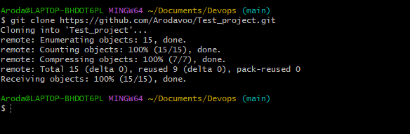

# Git Project

Git is a widely used distributed version control system for tracking changes in source code and other project files. It allows multiple developers to collaborate on a project, manage different branches of development, and track changes over time. Git is known for its efficiency, speed, and ability to work offline. It's used in software development and various other fields where version control and collaboration are essential. Key features include branching, merging, remote repositories, staging areas, and commits, all of which make it a powerful tool for managing and tracking project history.

##  Initializing a Git Repository

Before initializing a git repo you must have installed `git` in your computer.

Click on this  `Install Git` . Choose your operating system, could be windows, mac, or even linux. Download and install `git` in your computer.

Now to initialize a git repo follow these steps:

 • Open terminal on your computer, eg git bash,

  • On your terminal create your working folder or directory eg DevOps folder using this command `mkdir Devops`

  •Change or move into your working directory or folder using this command `cd Devops`
  • While you are inside the folder, run `git init` command

  

## Making The First Commit

 Commit is more or less saving the changes you made to your files. Changes can be adding, modifying or deleteing files or text.

When your make a commit, git takes a snapshot of the current state of your repository and saves a copy in the .git folder inside your working directory.
Now lets make our first commit by following these steps:

• Inside your working directory create a file index.txt using this command `touch index.txt`


• Write any sentence of your choice inside the text file. Afterwards, save your changes.


• Add your changes to git staging area using this command `git add`

• To commit your changes to git, run the command `git commit -m "initial commit"`


## Working With Branches

git branch helps you create a different copy(page) of your source code. In your new branch you can make changes as you please.

 Your change is independent of what is available in the main copy.

Git branch is commonly used to develop new feature of your application. You will agree with me that the initial code is untested and as such can not be added to the code base of your live application.

Git branch is also an important tool for collaboration within remote teams (developers working from different location). They can make separate branches while working on same feature. And at the end of the day, converge their code to one branch.

### Make you first git branch

To make a new branch run this command: `git checkout -b`
The -b flag helps your create and change into the new branch

Make a new branch by running this command `git checkout -b Bolt`


### Listing your git Branches

Use the command below to list the branches on your local git repository

`git branch`


### Change into an Old Branch

To change into an existing or old branch use the command below :
`git checkout <branch-name>`


### Merging a Branch into another Branch

If we have two branches A and B . And we want to add the content of Branch B into A.

First we change into branch A and run the git command below :

`git merge B`


### Deleting a git branch

when new feature is added to an application , it oftens done in a feature branch . usually this feature branch is deleted when the code must have been tested and merged into a staging or dev environment depending on the branch strategy of the team . 

Git branch can be deleted with the command below:

`git branch -d <branch_name>`


### Collaboration and Remote Repositories

We've mentioned in passing that git is used for collaboration among remote teams (developers residing in different location). But come to think of it how can developers working remotely collaborate (making changes, adding, updating etc) on the same code base since we currently have our code in our local computer.

This where github comes in. Github is a web based platform where git repositores are hosted. By hosting our local git repository on github, it becomes available in the public internet(it is possible to create private repository as well). Anyone can now access it.
Remote teams can now view, update, and make changes to the same repository.


Creating a Github Account

step 1: Head over to join github.com

step 2: Next enter your username, password, and email
 
 

 step 3 : Next click on the verify button to verify your identity

 


 step 4 : Next click on the create button to create your account

 

 step 5 : An activation code will be sent to your email , enter the code in textboxes provided then click continue

 

 Step 6 : Select your preferences and click continue 

 

 step 7 : A list of github plans will be shown to you . click continue for free

 ### Creating Your First Repository

 Step 1: Click on the plus sign at the top right of your github account . A drop down menu will appear , select new repository

 

 step 2 : fill out the form by adding a unique repository name , description and ticking the box to add a Readme.md file

 


Step 3 : click on the green butto below to create your repository


### Pushing your local git Repository to your Remote github Repository

In other to add a remote repository to a local repository , use the command :

`git remote add origin <link to your github repo>`


To get the remote link , click on the green button and copy the https link as shown below :


After Commiting your changes in your local repo . you push the content to the remote repo using the command below:

`git push origin <branch name>`


### Cloning Remote Git Repository

To enable collaboration and contributions to a project hosted on GitHub or any remote Git repository, the best practice is to create a local copy of the project on the machine. This local copy serves as the environment where i can freely make modifications without affecting the original project. The Git clone command is the key tool for achieving this. the syntax is :

`git clone <link to your remote repository>`



### Introduction to Markdown Syntax


Markdown syntax is a lightweight markup language that is widely used for formatting plain text. 

It allows you to add formatting elements to your text without using complex HTML or other formatting languages. Markdown is commonly used for creating documents, README files, forum posts, and even web pages.

Here is the most commonly used markdown syntax elements:

1. Headings: To create heading, use the hash symbol at the beginning of the line. The number of hash symbol used indicate the level of the heading.


```
# Heading 1
## Heading 2
### Heading 3

```

2. Emphasis: asterisks or underscore is used to Emphasis text
```
*italic* or _italic_
**bold** or __bold_

```

3. Lists: markdown has support for both ordered and unorderd list
unordered list example:

```
Item 1
Item 2
Item 3
```

ordered list example:
```
1. First item
2. Second item
3. Third item

```


4. Links:: To create a hyperlink, use square brackets for the link text followed by parentheses containing the URL.

example:

`[visit darey.io](https://www.darey.io)`


5. Images: To display an image, use an exclamation mark followed by square brackets for the alt text and parenthesis for the image url.


``


6. Code: To display code, use backticks () to enclose the code. 

Example :


`console.log('Welcome to darey.io')`


