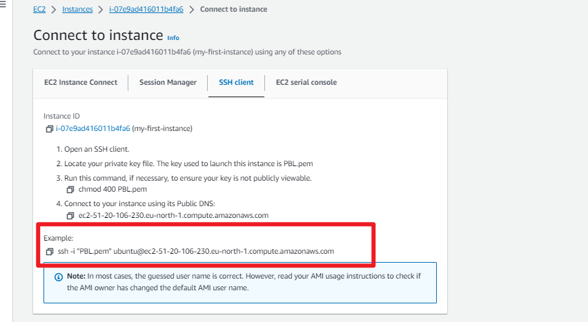
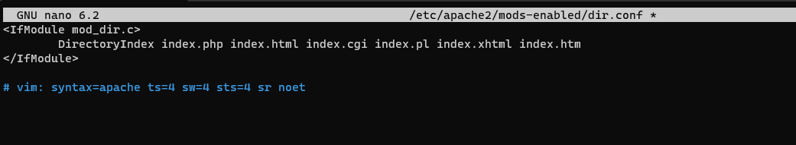

#### LAMP STACK IMPLEMENTATION


A technology stack is a set of frameworks and tools used to develop a software product. This set of frameworks and tools are very specifically chosen to work together in creating a well-functioning software. They are acronymns for individual technologies used together for a specific technology product. some examples are....

• LAMP (Linux, Apache, MySQL, PHP or Python, or Perl)

• LEMP (Linux, Nginx, MySQL, PHP or Python, or Perl)

• MERN (MongoDB, Express JS, ReactJS, NodeJS) 

• MEAN (MongoDB, Express JS, AngularJS, NodeJS)


### Preparing prerequisites


Step O- Preparing prerequisites
In order to complete this project you will need an AWS account and a virtual server with Ubuntu Server OS.
AWS is the biggest Cloud Service Provider and it offers a free tier account that we are going to leverage for our projects.
Do not focus too much on AWS itself right now, there will be a proper Cloud introduction and configuration projects later in a
course.
Right now, all we need to know is that AWS can provide us with a free virtual server called EC2 (Elastic Compute Cloud) for o needs.
Spinning up a new EC2 instance (an instance of a virtual server) is only a matter of a few clicks.
You can either Watch the videos below to get yourself set up.
1. [AWS account setup and Provisioning an Ubuntu Server](https://www.youtube.com/watch?v=xxKuB9kJoYM&list=PLtPuNR8I4TvkwU7Zu0l0G_uwtSUXLckvh&index=7)


2. [Connecting to your EC2 Instance
Or follow the instructions below](https://www.youtube.com/watch?v=TxT6PNJts-s&list=PLtPuNR8I4TvkwU7Zu0l0G_uwtSUXLckvh&index=9)


Alternatively , you can also follow the step by step guide below :

1. Register a new AWS account : [Create a new AWS Account](https://repost.aws/knowledge-center/create-and-activate-aws-account)

2. Select your preffered region, name your EC2 instance, Create a new key pair, and then launch your EC2 instance (choose t3.micro and ubuntu server 20.04 LTS)


3. There are different ways to connect to your EC2 instance but in this tutorial, we will use Git bash. 

Therefore, launch git and change to the directory where the key pair is downloaded (usually the downloads folder) using the below command :

cd Downloads


4. connect to the instance by running


`ssh -i "PBL.pem" ubuntu@ec2-51-20-106-230.eu-north-1.compute.amazonaws.com`


you can find this under under "SSH client" when you click on "connect" in the launched EC2 instance




5.  Copy the code to git and press "enter" to successfully connect to the ubuntu instance


## Installing Apache and Updating the Firewall


### Step 1 - Installing Apache and Updating the Firewall

Apache HTTP Server is the most widely used web server software. Developed and maintained by Apache Software Foundation, Apache is an open source software available for free. It runs on 67% of all webservers in the world. It is fast, reliable, and secure. It can be highly customized to meet the needs of many different environments by using extensions and modules. Most WordPress hosting providers use Apache as their web server software. However, websites and other applications can run on other web server software as well. Such as Nginx, Microsoft's IIS, etc.
The Apache web server is among the most popular web servers in the world. It's well documented, has an active community of users, and has been in wide use for much of the history of the web, which makes it a great default choice for hosting a website.
Install Apache using Ubuntu's package manager 'apt':

#update a list of packages in package manager

`sudo apt update`


#run apache2 package installation

`sudo apt install apache2`


To verify that Apache2 is running as as service in our OS, run the following command :

`sudo systemctl status apache2`


If it is green and running, then you did everything correctly and you have just lunched your first web server in the cloud.

In order for our webserver to receive any traffic, we need to open the http port 80 which is the default port that web browsers use to access web pages on the internet. Up until now only the SSH port 22 is open by default during our instance launch.

Port 80 can be opened by modifying the security group of the running EC2 instance.


Our server is now running and we can access it locally and from the internet.

To access it locally in out Ubuntu shell, run :

`curl http://localhost:80`

or

`curl http://127.0.0.1:80`

The 2 commands above are the same. The difference is that the first one uses the DNS name while the second uses the local IP which corresponds to the DNS name, localhost.

Next, we can test if our Apache HTTP server can respond to requests from the internet. Open any browser and try to access the url below :

http://<Public-IP-Address>:80

Another way to retrieve your public Ip address other than to check it in AWS console is to run the below command :

curl -s http://169.254.169.254/latest/meta-data/public-ipv4

Since all browsers use port 80 by default, it is not neccessary to specify the port number.
If you can see the below page, it means that you have correctly installed your Apache web server and accessible through your firewall.


infact it is the same result we got using the curl command but now represented in nice HTML format by the web browser.

## Installing Mysql

### Step 2 - Installing Mysql


Now that our webserver is up and running, we need to install a Database Management System (DBMS) to be able to store and manage data for our site. For this purpose, we will use Mysql, a relational database managemet system used within PHP environments.

To install 
Mysql-server, run the code below :

`sudo apt install mysql-server`

When prompted, confirm the installation by
typing y and the press enter.

 


When installation is completed, log in to mysql console using the command :

`sudo mysql`

This will connect to the administrative database user root and you will see an output as below :


it’s recommended that you run a security script that comes pre-installed with MySQL. This script will remove some insecure default settings and lock down access to your database system.

Then run the following ALTER USER command to change the root user’s authentication method to one that uses a password. The following example changes the authentication method to mysql_native_password:

`ALTER USER 'root'@'localhost' IDENTIFIED WITH mysql_native_password BY 'PassWord.1';`

After making this change, exit the MySQL prompt:

`mysql> exit`


Following that, you can run the mysql_secure_installation script without issue.

Start the interactive script by running:

`sudo mysql_secure_installation`

This will ask if you want to configure the VALIDATE PASSWORD PLUGIN.

Note: Enabling this feature is something of a judgment call. If enabled, passwords which don’t match the specified criteria will be rejected by MySQL with an error. It is safe to leave validation disabled, but you should always use strong, unique passwords for database credentials.

Answer Y for yes, or anything else to continue without enabling.

VALIDATE PASSWORD PLUGIN can be used to test passwords and improve security. It checks the strength of password and allows the users to set only those passwords which are secure enough. Would you like to setup VALIDATE PASSWORD plugin?

Press y|Y for Yes, any other key for No:

If you answer “yes”, you’ll be asked to select a level of password validation. Keep in mind that if you enter 2 for the strongest level, you will receive errors when attempting to set any password which does not contain numbers, upper and lowercase letters, and special characters:


Regardless of whether you chose to set up the VALIDATE PASSWORD PLUGIN, your server will next ask you to select and confirm a password for the MySQL root user. This is not to be confused with the system root. The database root user is an administrative user with full privileges over the database system. Even though the default authentication method for the MySQL root user doesn’t involve using a password, even when one is set, you should define a strong password here as an additional safety measure.

If you enabled password validation, you’ll be shown the password strength for the root password you just entered and your server will ask if you want to continue with that password. If you are happy with your current password, enter Y for “yes” at the prompt.

 For the rest of the questions, press Y and hit the ENTER key at each prompt. This will remove some anonymous users and the test database, disable remote root logins, and load these new rules so that MySQL immediately respects the changes you have made.


When you’re finished, test whether you’re able to log in to the MySQL console by typing:

`sudo mysql -p`


Notice that you need to provide a password to connect as the root user.
For increased security, it's best to have dedicated user accounts with less expansive privileges set up for every database, especially if you plan on having multiple databases hosted on your server.
Note: At the time of this writing, the native MySQL PHP library `mysqlnd` doesn't support `caching_sha2_authentication` , the default authentication method for MySQL 8. For that reason, when creating database users for PHP applications on MySQL 8, you'll need to make sure they're configured to use `mysql_native_password` instead.

Your MySQL server is now installed and secured. Next, we will install PHP, the final component in the LAMP stack.


## Installing PHP
### Step 3 - Installing PHP
You have Apache installed to serve your content and MySQL installed to store and manage your data. PHP is the component of our setup that will process code to display dynamic content to the final user. In addition to the php package, you’ll need php-mysql, a PHP module that allows PHP to communicate with MySQL-based databases. You’ll also need libapache2-mod-php to enable Apache to handle PHP files. Core PHP packages will automatically be installed as dependencies.

To install these 3 packages at once, run the following command:

`sudo apt install php libapache2-mod-php php-mysql`


Once the installation is finished, run the following command to confirm your PHP version:

`php -v`


At this point, your LAMP stack is fully operational.

`-[x]` Linux (Ubuntu)

`-[x]`Apache HTTP server

`-[x]`MySQL

`[x]` PHP

## Creating a Virtual Host for your Website using Apache

### Step 4 — Creating a Virtual Host for your Website Apache

Creating a virtual host in Apache allows you to host multiple websites on the same server with different domain names. Here are the general steps to create a virtual host for your website using Apache on a Linux-based system (like Ubuntu):

1. Create a Directory for Your Website:

Use the mkdir command to create a directory for your website. For example: 

`sudo mkdir /var/www/projectlamp`


2. set Permissions:

You may need to adjust the permissions to allow the web server to access the directory. Use the `chown` and `chmod` commands as necessary.


3. Create a virtual host configuration file in the /etc/apache2/sites-available/projectlamp. You can do this with a text editor like nano or vi. For example:


`sudo vi /etc/apache2/sites-available/projectlamp.conf`

4. Configure the Virtual Host:

In the virtual host configuration file, set up the virtual host with the following basic structure:

```
<VirtualHost *:80>

ServerAdmin webmaster@yourwebsite

ServerName yourwebsite.com

DocumentRoot /var/www/yourwebsite

ErrorLog ${APACHE_LOG_DIR}/yourwebsite_error.log

CustomLog ${APACHE_LOG_DIR}/yourwebsite_access.log combined

</VirtualHost>
```


To save and close the file, simply follow the steps below:

i. Hit the esc button on the keyboard

ii . Type :

iii . Type wq w for write and q for quit

iv . Hit enter to save the file

5. Enable the Virtual Host:
Use the `a2ensite` command to enable the virtual host. For example: 

6.  To make sure your configuration file doesn’t contain syntax errors, run the following command:

sudo apache2ctl configtest


7. Reload Apache:

To apply the changes, reload Apache:


Your new website is now active, but the web root /var/www/projectlamp is still empty. Create an index.html file in that location to test that the virtual host works as expected:

`sudo echo 'Hello LAMP from hostname' $(curl -s http://169.254.169.254/latest/meta-data/public-hostname) 16.171.52.33 $(curl -s http://169.254.169.254/latest/meta-data/public-ipv4) > /var/www/projectlamp/index.html`


Now go to your browser and access your server’s domain name or IP address:

`http://<Public-IP-Address>:80`


## Enable PHP on the website

### Step 5 - Enable PHP on the website

With the default DirectoryIndex settings on Apache, a file named index.html will always take precedence over an index.php file. This is useful for setting up maintenance pages in PHP applications, by creating a temporary index.html file containing an informative message to visitors. Because this page will take precedence over the index.php page, it will then become the landing page for the application. Once maintenance is over, the index.html is renamed or removed from the document root, bringing back the regular application page.

In case you want to change this behavior, you’ll need to edit the /etc/apache2/mods-enabled/dir.conf file and modify the order in which the index.php file is listed within the DirectoryIndex directive:

``` 

<IfModule mod_dir.c>


 #Change this:

#DirectoryIndex index.html index.cgi index.pl index.php index.xhtml index.htm        

#To this:

DirectoryIndex index.php index.html index.cgi index.pl index.xhtml index.htm


</IfModule>

```

`sudo nano /etc/apache2/mods-enabled/dir.conf`




After saving and closing the file, you’ll need to reload Apache so the changes take effect:

`sudo systemctl reload apache2`


Finally , we’ll create a PHP script to test that PHP is correctly installed and configured on your server.

Now that you have a custom location to host your website’s files and folders, create a PHP test script to confirm that Apache is able to handle and process requests for PHP files.

Create a new file named info.php inside your custom web root folder:

vim /var/www/projectlamp/info.php

This will open a blank file. Add the following text, which is valid PHP code, inside the file:


```
<?php
phpinfo();
```


Now you have created the info.php file with a simple PHP script that displays PHP configuration information. You can access this script through your web browser by visiting http://your-server-ip/info.php, where "your-server-ip" is the IP address or domain name of your server.

For example, my server's IP address is 16.171.52.33, you would access the script at http://16.171.52.33/info.php.


This page provides information about your server from the perspective of PHP. It is useful for debugging and to ensure that your settings are being applied correctly.

If you see this page in your browser, then your PHP installation is working as expected.

After checking the relevant information about your PHP server through that page, it’s best to remove the file you created as it contains sensitive information about your PHP environment and your Ubuntu server. Use rm to do so:

`sudo rm /var/www/projectlamp/info.php`


