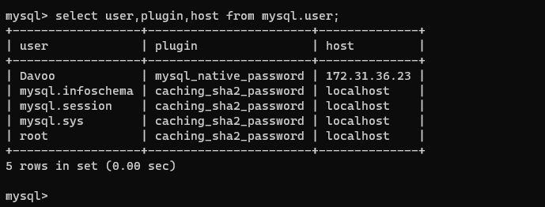

## understanding Client Server architechture with MYSQL as RDBMS

Client-Server refers to an architechture in which two or more computers are connected together over a network to send and receive requests between one another.

This can be illustrated with the diagram below :

In the above example, a machine that is trying to access a Web site using Web browser or simply curl command is a client and it sends HTTP requests to a Web server (Apache, Nginx, IIS or any other) over the internet.

If we extend this concept further with the addition of a Database Server, we get the below architecture :

In this case, our webserver has the role of a "Client" that connects and reads/writes to/from a Database (DB) server (MYSQL, MongoDB, Oracle, SQL server or any other) and the communication between them happens over a local Network (since it is a common practice the place the Web server and the DB server close to each other in a local Network) or through internet connection.

An example of the set up in the above diagram is the LAMP or LEMP stack previously implemented.

With reference to the LAMP stack project where we implemented a LAMP STACK website, we will use a commercially deployed LAMP website www.propitixhomes.com as an example.

This LAMP website server(s) can be located anywhere in the world and you can reach it also from any part of the globe over the internet.

By typing www.propitixhomes.com on your browser, your browser becomes the "Client" by sending request to the remote server and in turn wait for response from the remote server.

Let's do a quick demo of a client - server communication.

On windows or Ubuntu terminal run the curl command.
In this example, your terminal is the client and `www.propitixhomes.com` is the server.

The response from the remote server as seen in the below output shows that the URL is being served by a computer with an IP address `75.2.115.196 `on port `80`

`curl -Iv www.propitixhomes.com`

## Implement a Client Server Architecture using MYSQL Database Management System (DBMS).

To demonstrate a basic Client-server using MYSQL RDBMS, follow the below instructions.

 1. Create and configure two linux based virtual servers (EC2 instances in AWS).

`Server A name - mysql server`

`Server B name - mysql client`

2. On mysql server Linux Server, install MySQL server software.

3. On mysql client Linux Server, install MySQL Client software.

4. By default, both of our EC2 virtual servers are located in the same local virtual network, so they can communicate with each other using local IP addresses. We use mysql server’s local IP address to connect from mysql client. MySQL server uses TCP port 3306 by default, so we must open it by creating a new entry in ‘Inbound rules’ in ‘mysql server’ Security Groups. For extra security, do not allow all IP addresses to reach the ‘mysql server.’ Only allow access to the specific local IP address of the ‘mysql client.

5. To configure MySQL server to allow connections from remote hosts, use vim to open the mysqld.cnf file with this command:

`sudo nano /etc/mysql/mysql.conf.d/mysqld.cnf`

Search for the bind-address and Replace ‘127.0.0.1’ to ‘0.0.0.0’ like this:

After configuring mysql server to allow connections from remote hosts, we need to create a remote user that can access our database from remote hosts. To do this, we first connect to our mysql database on the mysql server EC2 instance:

`sudo mysql`

We can list all users in our database with the command:

`select user,plugin,host from mysql.user;`

This displays the list of all users that can access our database. To create a new remote user:

CREATE USER 'Davoo'@'172.31.36.23' IDENTIFIED WITH mysql_native_password BY 'Davoo_Strong@P4ss';

Davoo is the username, and the password is Davoo_Strong@P4ss , as shown in the command.

To verify our new user has been created, we run the command:

`select user,plugin,host from mysql.user;`

And we can see that user Davoo is now created.

Connecting to database from MySQL Client EC2 instance.

After creating the remote user, we can now head to the mysql client EC2 instance shell and connect to the database by using the command:

`mysql -h 172.31.36.226 -u Davoo -p`

NB: The IP address in the command is the private IP address of the MySQL Server EC2 instance.

The connection was successful. We can now start running queries on the database:

`show databases;`

With this, we have successfully implemented a client-server architecture using MySQL DBMS on AWS.

## Thank you!

