## Introduction to Shell Scripting and User Input

Shell scripting in Linux is a powerful and fundamental aspect of the operating system, allowing users to automate tasks, manage system configurations, and enhance productivity. 

### Shell Scripting Syntax Element

1. Variables : Bash allows you to define and work with variables. Variables can store data of all types such as numbers, strings and arrays. You can assign values to variables using == operator and access their values using the variable name preceded by a $ sign.

Example: Assigning value to a variable :

`name="John"`

Example: Retrieving value from a variable :

`echo $name`

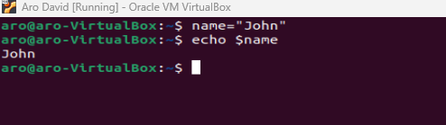

2. Control flow : Bash provides control flow statements like if-else, for loops, while loops ans case statements to control the flow of execution in your scripts. These statements allow you to make decisions, iterate over lists and, executes different commands based on conditions.

Example: Using if-else to execute scripts based on conditions :

```
#!/bin/bash

# Example script to check if a number is positive, negative, or zero

read -p "Enter a number: " num

if [ $num -gt 0 ]; then
    echo "The number is positive."
elif [ $num -lt 0 ]; then
    echo "The number is negative."
else
    echo "The number is zero."
fi
```

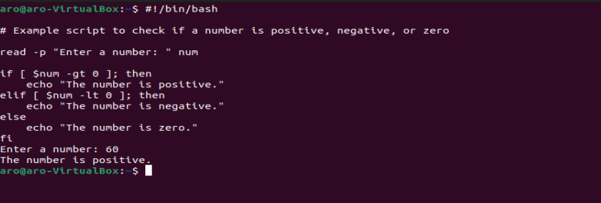

Example: Iterating through a list using a for loop :

```
#!/bin/bash

# Example script to print numbers from 1 to 5 using a for loop

for (( i=1; i<=5; i++ ))
do
    echo $i
done
```

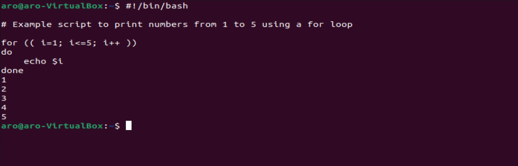


3. Command substitution : Command substitution allows you to capture the output of a command and use it as a value within your script. You can use the backtick or the syntax $() for it.

Example : Using backtick for command substitution


```
current_date=`date +%Y-%m-%d

```

Example : Using $() syntax for command substitution

`current_date=$(date +%Y-%m-%d)`

4. Input and Output : Bash provides various ways to handle inputs and outputs. You can use the read command to accept user input, and output text to the console using the echo command. Additionally, you can redirect input and output using operators like > (output to a file), < (input from a file), and | (pipe the output of one command as input to the other).

Example : Accept user input

`echo "Enter your name:"
read name`


`echo "Hello World"`

Example : Output the result of a command into a file

`echo "hello world" > index.txt`

Example : Pass the content of a file as input to a command

`grep "pattern" < input.txt`

Example : Pass the result of a command as input to another command

`echo "hello world" | grep "pattern"`

5. Functions : Bash allows you to define and use functions to group related commands together. Functions provide a way to modularize your code and make it more reusable. You can define function by using the function keyword or simply by declaring the function name followed by parentheses.

```
#!/bin/bash

# Define a function to greet the user
greet() {
    echo "Hello, $1! Nice to meet you."
}

# Call the greet function and pass the name as an argument
greet "John"
```

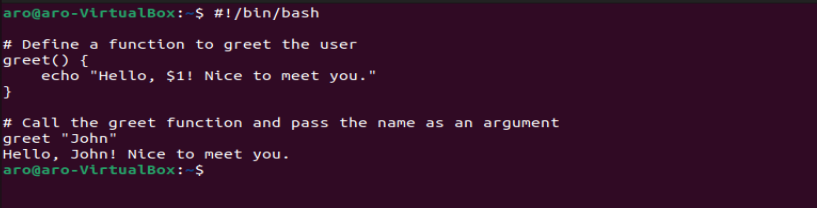


## Let's write our first shell script

Step 1 : On your terminal, open a folder called shell scripting using the command `mkdir shell-scripting.`  This will hold all the scripts that we will write in this project.

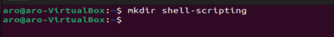


Step 2 : Create a file called user-input.sh using the command `touch user-input.sh

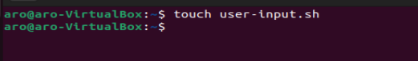

Step 3 : Inside the file, copy and paste the block of code below :
```
#!/bin/bash

# Prompt the user for their name
echo "Enter your name:"
read name

# Display a greeting with the entered name
echo "Hello, $name! Nice to meet you."
```

The above script prompts for your name. After typing your name, it dispalys the text hello! Nice to meet you. Also `#!/bin/bash `specifies the type of interpreter to be used to execute the script.

Step 4 : Save your file

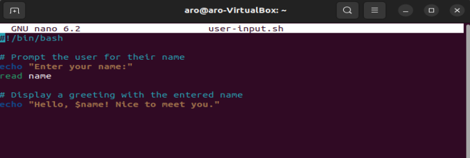

Step 5 : Run the command using `sudo chmod +x user-input.sh`

Step 6 : Run the script using the command` ./user-input.sh`


## Directory Manipulation and Navigation

We will write a simple script that will display the current directory, create a new directory called "my_directory", change to that directory, create two files inside it, list the files, move back one level up, remove the "my_directory" and its contents and finally list the files in the current directory again.

Follow the steps below to do that :

Step 1 : Open a file named navigating-linux-filesystem.sh

Step 2 : Paste the code block below into the file.

```
#!/bin/bash

# Display current directory
echo "Current directory: $PWD"

# Create a new directory
echo "Creating a new directory..."
mkdir my_directory
echo "New directory created."

# Change to the new directory
echo "Changing to the new directory..."
cd my_directory
echo "Current directory: $PWD"

# Create some files
echo "Creating files..."
touch file1.txt
touch file2.txt
echo "Files created."

# List the files in the current directory
echo "Files in the current directory:"
ls

# Move one level up
echo "Moving one level up..."
cd ..
echo "Current directory: $PWD"

# Remove the new directory and its contents
echo "Removing the new directory..."#
rm -rf my_directory
echo "Directory removed."

# List the files in the current directory again
echo "Files in the current directory:"
ls

```

Step 3 : Run the command below to set execute permission on the file :

`sudo chmod +x navigating-linux-filesystem.sh`


Step 4 : Run the script using the command :

`./navigating-linux-filesystem.sh`

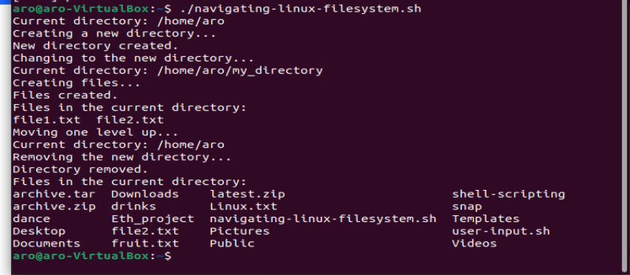


## File Operations and Sorting

We will be writing a simple shell script that that focuses on file operations and sorting.

This script creates three files (file1.txt, file2.txt, and file3.txt), displays the files in their current order, sorts them alphabetically, saves the sorted files in sorted_files.txt, displays the sorted files, removes the original files, renames the sorted file to sorted_files_sorted_alphabetically.txt, and finally dispalys the contents of the final sorted files.

To do this, let's follow the below steps :

Step 1 : Open a terminal and create a file called sorting.sh using the command `touch sorting.sh`

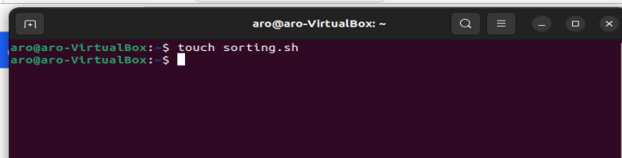

Step 2 : Copy and paste the code block below into the file.


```
#!/bin/bash

# Create three files
echo "Creating files..."
echo "This is file3." > file3.txt
echo "This is file1." > file1.txt
echo "This is file2." > file2.txt
echo "Files created."

# Display the files in their current order
echo "Files in their current order:"
ls

# Sort the files alphabetically
echo "Sorting files alphabetically..."
ls | sort > sorted_files.txt
echo "Files sorted."

# Display the sorted files
echo "Sorted files:"
cat sorted_files.txt

# Remove the original files
echo "Removing original files..."
rm file1.txt file2.txt file3.txt
echo "Original files removed."

# Rename the sorted file to a more descriptive name
echo "Renaming sorted file..."
mv sorted_files.txt sorted_files_sorted_alphabetically.txt
echo "File renamed."

# Display the final sorted file
echo "Final sorted file:"
cat sorted_files_sorted_alphabetically.txt

```

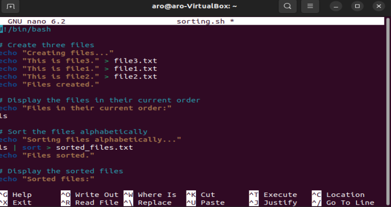


Step 3 : Set execute permission on sorting.sh using the command `sudo chmod +x sorting.sh`

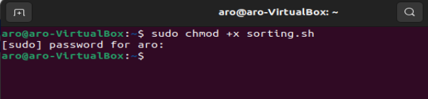

Step 4 : Run your script using the command `./sorting.sh`

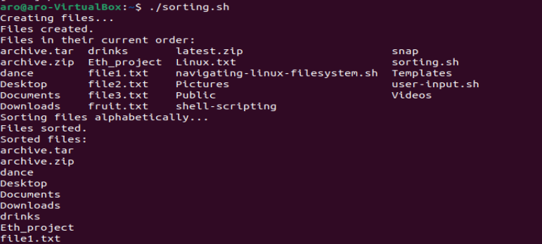


Working with Numbers and Calculations
This script defines two variables num1 and num2 with numeric values, performs basic arithmetic operations (addition, subtraction, multiplication, division, and modulus), and displays the results. It also performs more complex calculations such as raising num1 to the power of 2 and calculating the square root of num2, and dispalys those results as well.

Let's proceed by following the steps below :

Step 1 : On your terminal, create a file named `calculations.sh` using the command `touch calculations .sh`

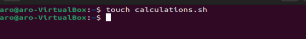


Step 2 : Copy and paste the code block below into the file :

```
#!/bin/bash

# Define two variables with numeric values
num1=10
num2=5

# Perform basic arithmetic operations
sum=$((num1 + num2))
difference=$((num1 - num2))
product=$((num1 * num2))
quotient=$((num1 / num2))
remainder=$((num1 % num2))

# Display the results
echo "Number 1: $num1"
echo "Number 2: $num2"
echo "Sum: $sum"
echo "Difference: $difference"
echo "Product: $product"
echo "Quotient: $quotient"
echo "Remainder: $remainder"

# Perform some more complex calculations
power_of_2=$((num1 ** 2))
square_root=$(echo "sqrt($num2)" | bc)

# Display the results
echo "Number 1 raised to the power of 2: $power_of_2"
echo "Square root of number 2: $square_root"

```
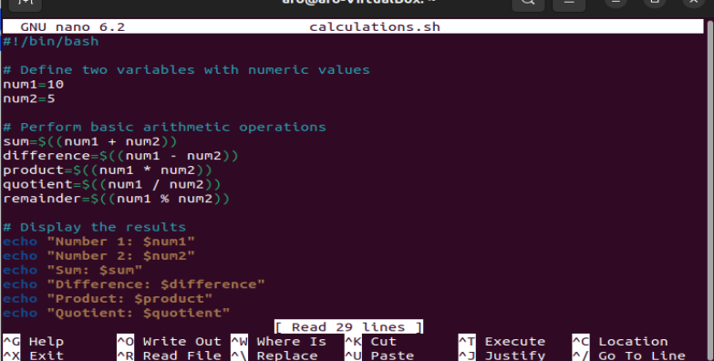


Step 3 : Set execute permission on `calculations.sh` using the command `sudo chmod +x calculations.sh`

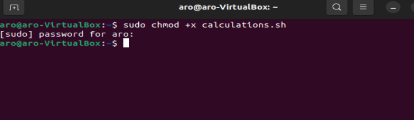


Step 4 : Run your script using this command `  ./calculations.sh`

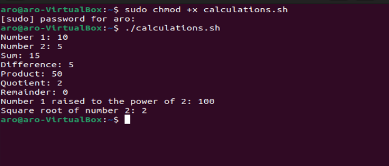

## File Backup and Timestamping

### File Backup and Timestamping

This shell scripting example is focused on file backup and timestamp. As a DevOps Engineer backing up databases and other storage devices is one of the most common task you get to carryout.
This script defines the source directory and backup directory paths. It then creates a timestamp using the current date and time, and creates a backup directory with the timestamp appended to its name. The script then copies all files from the source directory to the backup directory using the cp command with the -r option for recursive copying. Finally, it displays a message indicating the completion of the backup process and shows the path of the backup directory with the timestamp.
Lets proceed using the steps bellow:

step 1: On your terminal open a file `backup.sh `using the command `touch backup.sh`
step 2: Copy and paste the code block below into the file.

```
#!/bin/bash

# Define the source directory and backup directory
source_dir="/path/to/source_directory"
backup_dir="/path/to/backup_directory"

# Create a timestamp with the current date and time
timestamp=$(date +"%Y%m%d%H%M%S")

# Create a backup directory with the timestamp
backup_dir_with_timestamp="$backup_dir/backup_$timestamp"

# Create the backup directory
mkdir -p "$backup_dir_with_timestamp"

# Copy all files from the source directory to the backup directory
cp -r "$source_dir"/* "$backup_dir_with_timestamp"

# Display a message indicating the backup process is complete
echo "Backup completed. Files copied to: $backup_dir_with_timestamp"

```
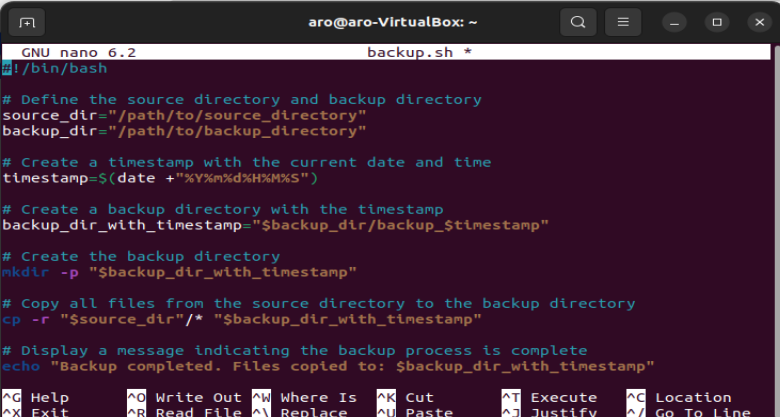

Step 3 : Set execute permission on backup.sh using the ecommand `sudo chmod +x backup.sh`


Step 4 : Run your script using this command :` ./backup.sh`

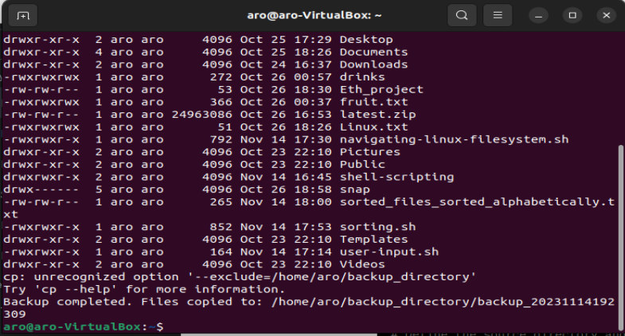

